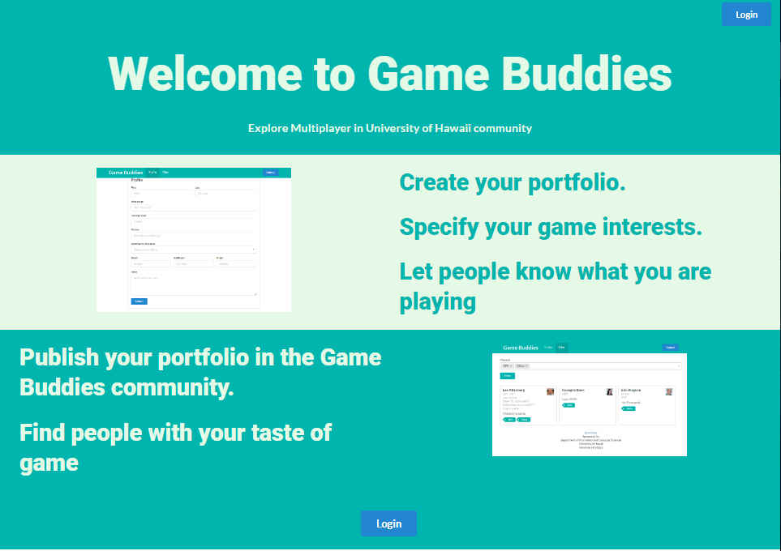

# Table of contents
* [About Game Buddies](#about-game-buddies)
* [Installation](#installation)
* [Development History](#development-history)
  * [Milestone 1: Deployment / Landing Page / Mockup Pages](#milestone-1)

# About Game Buddies 


There are many anti-social gamers at UH Manoa. UH Manoa gamers generally just play with themselves or with their close group of friends prior to college. It is hard to find someone else with the same game interest and time frames of which they can play with each other. Therefore, Game Buddies is an application which tries to help anti-social gamers increase communication and social interaction between each other.  



Game Buddies will allow users to find others who want to play a new game that isn't currently found in the database. By allowing the users to actively add information about a particular game, and what types of players it needs, will make Game Buddies evolve as the community grows.  


Game Buddies allows students to login and create a profile indicating their gaming tastes, their gaming capabilities, their gaming goals (playing for fun or competitively / against or with each other), and their gaming times. The profile can include links to their gaming profiles containing their IGN, etc. (Ex. Steam, Blizzard, Maplestory, etc).  


Once a profile is created, other can browse the profiles filtered by specific gaming tastes, capabilities, goals, and times. Students can also be notified if a match has been found and has the option of contacting the person via the information that the matching person(s) provided.  

# Installation
First, [install Meteor](https://www.meteor.com/install).

Second, [download a copy of Warrior Gamers](https://github.com/314gb/warrior-gamers), or clone it using git.
  
Third, cd into the app/ directory and install libraries with:

```
$ meteor npm install
```

Fourth, run the system with:

```
$ meteor npm run start
```

If all goes well, the application will appear at [http://localhost:3000](http://localhost:3000). If you have an account on the UH test CAS server, you can login and test the application.

# Development History
## Milestone 1
This milestone started on December 7 and is still a work in progress.

### Goals
The goals of Milestone 1 was to deploy our system to Galaxy, create a landing page, and create four other mockup pages.

### Deployment

The deployed website can be found at [http://warriorgamers.meteorapp.com/](http://warriorgamers.meteorapp.com/)

### Landing Page

This is our current landing page so far, it is still a work in progress.

### Mockup Pages
This is currently being worked on. Will be updated later.

# Support or Contact
If you have any questions or concerns, please do not hesitate to slack message us @yizan_chen, @kalani_sanidad, @tevin_sales, and @saehyun_song.
