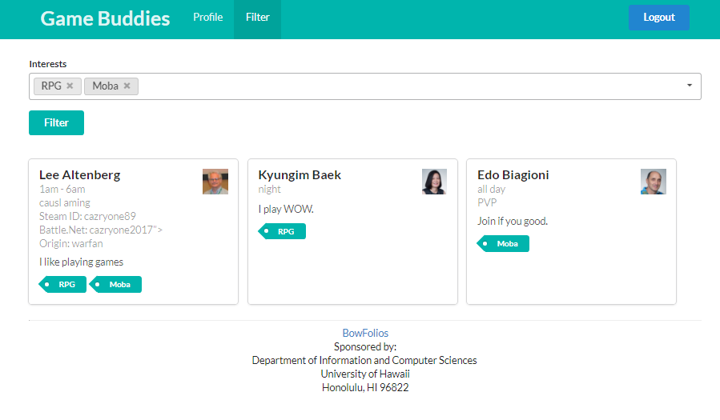

# Table of contents
* [About Game Buddies](#About-Game-Buddies)
* [What will Game Buddies Provide?](#What-will-Game-Buddies-provide?)

# About Game Buddies 

There are many anti-social gamers at UH Manoa. UH Manoa gamers generally just play with themselves or with their close group of friends prior to college. It is hard to find someone else with the same game interest and time frames of which they can play with each other. Therefore, Game Buddies is an application which tries to help anti-social gamers increase communication and social interaction between each other.

## Game Buddies Landing Page:


# What will Game Buddies provide?

Game Buddies allows students to login and create a profile indicating their gaming tastes, their gaming capabilities, their gaming goals (playing for fun or competitively / against or with each other), and their gaming times. The profile can include links to their gaming profiles containing their IGN, etc. (Ex. Steam, Blizzard, Maplestory, etc) Once a profile is created, other can browse the profiles filtered by specific gaming tastes, capabilities, goals, and times. Students can also be notified if a match has been found and has the option of contacting the person via the information that the matching person(s) provided. Admins can monitor the site for inappropriate content, create new categories of gaming tastes, goals, capabilities, and to ban anyone who violates the Terms of Use and Conditions. Both student and admins can log in with their UH account. Include a link to a discord page for Game Buddies so that people can interact with each other via a very widely used, popular VoIP application.

Game Buddies will allow users to find others who want to play a new game that isn't currently found in the database. By allowing the users to actively add information about a particular game, and what types of players it needs, will make Game Buddies evolve as the community grows.  

## Game Buddies Filter Page:


## Game Buddies Profile Page:


### Markdown
Markdown is a lightweight and easy-to-use syntax for styling your writing. It includes conventions for

```markdown
Syntax highlighted code block

# Header 1
## Header 2
### Header 3

- Bulleted
- List

1. Numbered
2. List

**Bold** and _Italic_ and `Code` text

[Link](url) and 
```

For more details see [GitHub Flavored Markdown](https://guides.github.com/features/mastering-markdown/).

### Jekyll Themes

Your Pages site will use the layout and styles from the Jekyll theme you have selected in your [repository settings](https://github.com/314gb/314gb.github.io/settings). The name of this theme is saved in the Jekyll `_config.yml` configuration file.

### Support or Contact

Having trouble with Pages? Check out our [documentation](https://help.github.com/categories/github-pages-basics/) or [contact support](https://github.com/contact) and we’ll help you sort it out.
