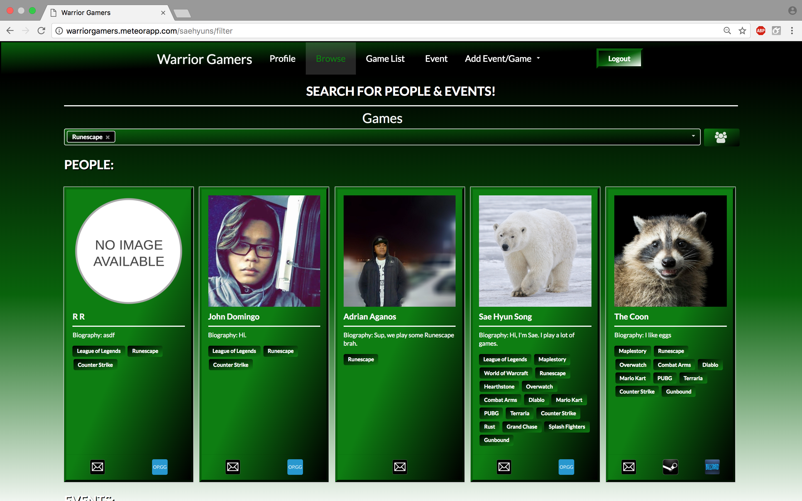
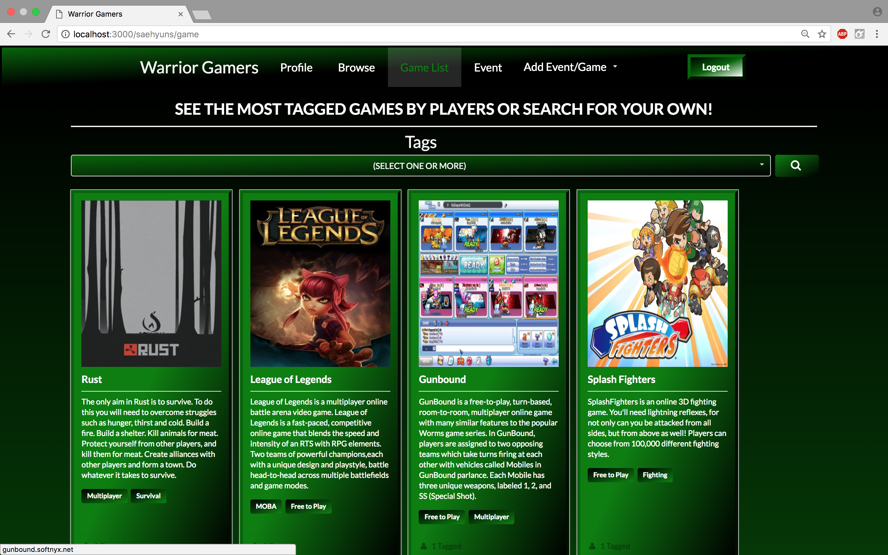
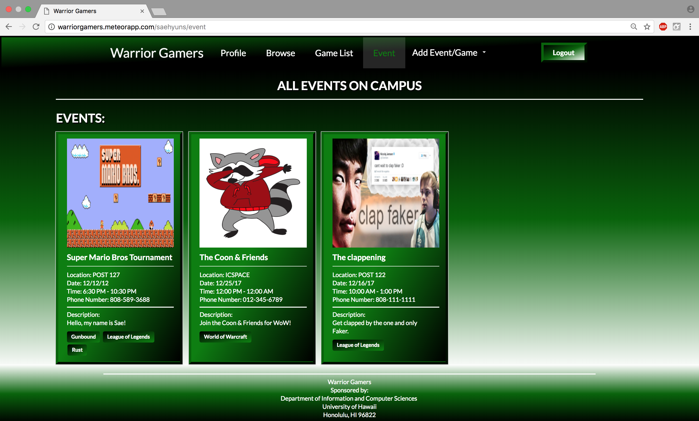

# Table of contents
* [Link to 314GB Github Organization](https://github.com/314gb)
* [Link to the Warrior Gamers website](http://warriorgamers.meteorapp.com/)
* [About Warrior Gamers](#about-warrior-gamers)
  * [Overview](#overview)
  * [User Guide](#user-guide)
* [Community Feedback](#community-feedback)
* [Installation](#installation)
* [Application design](#application-design)
  * [Directory structure](#directory-structure)
  * [Import conventions](#import-conventions)
  * [Naming conventions](#naming-conventions)
  * [Data model](#data-model)
  * [CSS](#css)
  * [Routing](#routing)
  * [Authentication](#authentication)
  * [Authorization](#authorization)
  * [Configuration](#configuration)
  * [Quality Assurance](#quality-assurance)
    * [ESLint](#eslint)
    * [Data model unit tests](#data-model-unit-tests)
* [Development History](#development-history)
    * [Milestone 1: Deployment / Landing Page / Mockup Pages](#milestone-1)
    * [Milestone 2: Additional Functionalities](#milestone-2)
* [Support or Contact](#support-or-contact)

# About Warrior Gamers 


## Overview
There are many anti-social gamers at UH Manoa. UH Manoa gamers generally just play with themselves or with their close group of friends prior to college. It is hard to find someone else with the same game interest and time frames of which they can play with each other. Therefore, Game Buddies is an application which tries to help anti-social gamers increase communication and social interaction between each other.  

## User Guide

This is the [Landing Page](http://warriorgamers.meteorapp.com/) for the Warrior Gamers
app. It contains a brief slideshow of what the application contains.


This is the [View Profile Page](http://warriorgamers.meteorapp.com/saehyuns/gamer-profile) for
the Warrior Gamers app. It contains your profile that you have created. Your name at
the top, biography, the games that you play, and your profiles for steam, blizzard, and 
summoner profiles taking you to the respective links that are related. For example, 
clicking on your summer profile name will take you to your op.gg profile page.


This is the [Change Profile Page](http://warriorgamers.meteorapp.com/saehyuns/gamer-profile)
of the Warrior Gamers App. It contains the form in which you need to fill our in order
to create your profile. Your profile information will be available to other people using
the application. So if they are interested in playing with you, they can contact you.


This is the [Browse Page](http://warriorgamers.meteorapp.com/saehyuns/filter) of the
Warrior Gamers App. It initially contains all the people in the database. You can choose
to narrow down your search based off games. It will show all profiles with the related games.
It also contains events in which you can search for based off of the game you are interested in.


For example, if you search for Runescape, it will reduce the profiles to only show people
with the Runescape tag attached to their profile.


This is the [Game List Page](http://warriorgamers.meteorapp.com/saehyuns/game) of the 
Warrior Gamers App. It contains the various games that are currently in the database. 
It contains the game picture, the title of the game, the game description, and tags
related to the game. In case you're curious on what the tags do, you can click on them
and it will take you to a google search of that definition. You may also search for certain
games with certain tags related to it.


This is an example of what happens when you search "Survival" on the page. It will 
show all games with the Survival tag in it.


This is the [Event List Page](http://warriorgamers.meteorapp.com/saehyuns/event) of the
Warrior Gamers App. It contains all the events that are currently happening on campus.
It contains the picture, title, information, and description of the event along with
game tags related to the event.


This is the [Add Event Page](http://warriorgamers.meteorapp.com/saehyuns/addEvent) of the
Warrior Gamers App. It will contain a form for users to be able to add an event for other
players to see and possibly attend. It will require a name, picture, date, phone, time,
location, games, and descriptions associated with that event. You will have to put specific
input by following the placeholder in the field. Otherwise, it will not allow you to add it. 
It will be monitored and removed if inappropriate.


This is the [Add Game Page](http://warriorgamers.meteorapp.com/saehyuns/addGame) of the
Warrior Gamers App. It will contain a form for users to be able to add a game for other
players to see. It will require a name, picture, link to the website, description, and tags related
to the game. It will be monitored and removed if inappropriate.

# Community Feedback
-


-

# Installation
First, [install Meteor](https://www.meteor.com/install).

Second, [download a copy of Warrior Gamers](https://github.com/314gb/warrior-gamers), or clone it using git.
  
Third, cd into the app/ directory and install libraries with:

```
$ meteor npm install
```

Fourth, run the system with:

```
$ meteor npm run start
```

If all goes well, the application will appear at [http://localhost:3000](http://localhost:3000). If you have an account on the UH test CAS server, you can login and test the application.

# Application Design

## Directory structure

The top-level directory structure contains:

```
app/        # holds the Meteor application sources
config/     # holds configuration files, such as settings.development.json
.gitignore  # don't commit IntelliJ project files, node_modules, and settings.production.json
```

This structure separates configuration files (such as the settings files) in the config/ directory from the actual Meteor application in the app/ directory.

The app/ directory has this top-level structure:

```
client/
  lib/           # holds Semantic UI files.
  head.html      # the <head>
  main.js        # import all the client-side html and js files. 

imports/
  api/           # Define collection processing code (client + server side)
    base/
    interest/
    profile/
  startup/       # Define code to run when system starts up (client-only, server-only)
    client/        
    server/        
  ui/
    components/  # templates that appear inside a page template.
    layouts/     # Layouts contain common elements to all pages (i.e. menubar and footer)
    pages/       # Pages are navigated to by FlowRouter routes.
    stylesheets/ # CSS customizations, if any.

node_modules/    # managed by Meteor

private/
  database/      # holds the JSON file used to initialize the database on startup.

public/          
  images/        # holds static images for landing page and predefined sample users.
  
server/
   main.js       # import all the server-side js files.
```

## Import conventions

This system adheres to the Meteor 1.4 guideline of putting all application code in the imports/ directory, and using client/main.js and server/main.js to import the code appropriate for the client and server in an appropriate order.

This system accomplishes client and server-side importing in a different manner than most Meteor sample applications. In this system, every imports/ subdirectory containing any Javascript or HTML files has a top-level index.js file that is responsible for importing all files in its associated directory.   

Then, client/main.js and server/main.js are responsible for importing all the directories containing code they need. For example, here is the contents of client/main.js:

```
import '/imports/startup/client';
import '/imports/ui/components/form-controls';
import '/imports/ui/components/directory';
import '/imports/ui/components/user';
import '/imports/ui/components/landing';
import '/imports/ui/layouts/directory';
import '/imports/ui/layouts/landing';
import '/imports/ui/layouts/shared';
import '/imports/ui/layouts/user';
import '/imports/ui/pages/directory';
import '/imports/ui/pages/filter';
import '/imports/ui/pages/home';
import '/imports/ui/pages/game';
import '/imports/ui/pages/add';
import '/imports/ui/pages/event';
import '/imports/ui/pages/landing';
import '/imports/ui/pages/user';
import '/imports/ui/stylesheets/style.css';
import '/imports/api/base';
import '/imports/api/profile';
import '/imports/api/interest';
```

Apart from the last line that imports style.css directly, the other lines all invoke the index.js file in the specified directory.

We use this approach to make it more simple to understand what code is loaded and in what order, and to simplify debugging when some code or templates do not appear to be loaded.  In our approach, there are only two places to look for top-level imports: the main.js files in client/ and server/, and the index.js files in import subdirectories. 

Note that this two-level import structure ensures that all code and templates are loaded, but does not ensure that the symbols needed in a given file are accessible.  So, for example, a symbol bound to a collection still needs to be imported into any file that references it. 
 
## Naming conventions

This system adopts the following naming conventions:

  * Files and directories are named in all lowercase, with words separated by hyphens. Example: accounts-config.js
  * "Global" Javascript variables (such as collections) are capitalized. Example: Profiles.
  * Other Javascript variables are camel-case. Example: collectionList.
  * Templates representing pages are capitalized, with words separated by underscores. Example: Directory_Page. The files for this template are lower case, with hyphens rather than underscore. Example: directory-page.html, directory-page.js.
  * Routes to pages are named the same as their corresponding page. Example: Directory_Page.


## Data model

The Warrior Gamers data model is implemented by two Javascript classes: [GamerProfileCollection.js](https://github.com/314gb/warrior-gamers/blob/master/app/imports/api/profile/GamerProfileCollection.js) and [GameCollection](https://github.com/314gb/warrior-gamers/blob/master/app/imports/api/interest/GameCollection.js). Both of these classes encapsulate a MongoDB collection with the same name and export a single variable (GamerProfiles and GameCollection) that provides access to that collection. 

Any part of the system that manipulates the BowFolios data model imports the Profiles or Interests variable, and invokes methods of that class to get or set data.

There are many common operations on MongoDB collections. To simplify the implementation, the GamerProfileCollection and GameCollection classes inherit from the [BaseCollection](https://github.com/314gb/warrior-gamers/blob/master/app/imports/api/base/BaseCollection.js) class.

The [BaseUtilities](https://github.com/314gb/warrior-gamers/blob/master/app/imports/api/base/BaseUtilities.js) file contains functions that operate across both classes. 

## CSS

The application uses the [Semantic UI](http://semantic-ui.com/) CSS framework. To learn more about the Semantic UI theme integration with Meteor, see [Semantic-UI-Meteor](https://github.com/Semantic-Org/Semantic-UI-Meteor).

The Semantic UI theme files are located in [app/client/lib/semantic-ui](https://github.com/ics-software-engineering/meteor-application-template/tree/master/app/client/lib/semantic-ui) directory. Because they are located in the client/ directory and not the imports/ directory, they do not need to be explicitly imported to be loaded. (Meteor automatically loads all files into the client that are located in the client/ directory). 

Note that the user pages contain a menu fixed to the top of the page, and thus the body element needs to have padding attached to it.  However, the landing page does not have a menu, and thus no padding should be attached to the body element on that page. To accomplish this, the [router](https://github.com/bowfolios/bowfolios/blob/master/app/imports/startup/client/router.js) uses "triggers" to add an remove the appropriate classes from the body element when a page is visited and then left by the user. 

## Routing

For display and navigation among its six pages, the application uses [Flow Router](https://github.com/kadirahq/flow-router).

Routing is defined in [imports/startup/client/router.js](https://github.com/314gb/warrior-gamers/blob/master/app/imports/startup/client/router.js).

BowFolios defines the following routes:

  * The `/` route goes to the public landing page.
  * The `/directory` route goes to the public directory page.
  * The `/<user>/profile` route goes to the profile page associated with `<user>`, which is the UH account name.
  * The `/<user>/filter` route goes to the filter page associated with `<user>`, which is the UH account name.


## Authentication

For authentication, the application uses the University of Hawaii CAS test server, and follows the approach shown in [meteor-example-uh-cas](http://ics-software-engineering.github.io/meteor-example-uh-cas/).

When the application is run, the CAS configuration information must be present in a configuration file such as  [config/settings.development.json](https://github.com/ics-software-engineering/meteor-application-template/blob/master/config/settings.development.json). 

Anyone with a UH account can login and use WarriorGamers to create a gamer profile.  A gamer profile is created for them if none already exists for that username.

## Authorization

Only the landing page is available to the public.

In order to access the pages besides the landing page: you must be logged in (i.e. authenticated) through the UH test CAS server, and the authenticated username returned by CAS must match the username specified in the URL.  So, for example, only the authenticated user `johnson` can access the pages `http://localhost:3000/johnson/profile` and  `http://localhost:3000/johnson/filter`.

To prevent people from accessing pages they are not authorized to visit, template-based authorization is used following the recommendations in [Implementing Auth Logic and Permissions](https://kadira.io/academy/meteor-routing-guide/content/implementing-auth-logic-and-permissions). 

The application implements template-based authorization using an If_Authorized template, defined in [If_Authorized.html](https://github.com/bowfolios/bowfolios/blob/master/app/imports/ui/layouts/user/if-authorized.html) and [If_Authorized.js](https://github.com/bowfolios/bowfolios/blob/master/app/imports/ui/layouts/user/if-authorized.js).

## Configuration

The [config](https://github.com/bowfolios/bowfolios/tree/master/config) directory is intended to hold settings files.  The repository contains two files: [config/settings.development.json](https://github.com/bowfolios/bowfolios/blob/master/config/settings.development.json) and settings.production.json. The settings.production.json file will not be available as a link due to privacy / credential issues.

The [.gitignore](https://github.com/bowfolios/bowfolios/blob/master/.gitignore) file prevents a file named settings.production.json from being committed to the repository. So, if you are deploying the application, you can put settings in a file named settings.production.json and it will not be committed.

Warrior Gamers checks on startup to see if it has an empty database in [initialize-database.js](https://github.com/bowfolios/bowfolios/blob/master/app/imports/startup/server/initialize-database.js), and if so, loads the file specified in the configuration file, such as [settings.development.json](https://github.com/bowfolios/bowfolios/blob/master/config/settings.development.json).  For development purposes, a sample initialization for this database is in [initial-collection-data.json](https://github.com/bowfolios/bowfolios/blob/master/app/private/database/initial-collection-data.json).

Also it uses the settings.development.json file to link the json file to the database on mLab linking that database to the deployment on Meteor Galaxy.

## Quality Assurance

### ESLint

Warrior GAmers includes a [.eslintrc](https://github.com/bowfolios/bowfolios/blob/master/app/.eslintrc) file to define the coding style adhered to in this application. You can invoke ESLint from the command line as follows:

```
meteor npm run lint
```

ESLint should run without generating any errors.  

It's significantly easier to do development with ESLint integrated directly into your IDE (such as IntelliJ).

### Data model unit tests

To run the unit tests on the data model, invoke the script named 'test', which is defined in the package.json file:

```
meteor npm run test
```

This outputs the results to the console. Here is an example of a successful run, with timestamps removed:

```
meteor npm run test

> bowfolios@ test /Users/SaeHyunSong/Documents/GitHub/warrior-gamers/app
> cross-env TEST_WATCH=1 meteor test --driver-package meteortesting:mocha

[[[[[ Tests ]]]]]

=> Started proxy.
=> Started MongoDB.
I20171121-22:47:46.718(-10)?
I20171121-22:47:46.788(-10)? --------------------------------
I20171121-22:47:46.789(-10)? ----- RUNNING SERVER TESTS -----
I20171121-22:47:46.790(-10)? --------------------------------
I20171121-22:47:46.790(-10)?
I20171121-22:47:46.792(-10)?
I20171121-22:47:46.793(-10)?
I20171121-22:47:46.794(-10)?   InterestCollection
=> Started your app.

=> App running at: http://localhost:3000/
    ✓ #define, #isDefined, #removeIt, #dumpOne, #restoreOne (139ms)
    ✓ #findID, #findIDs-10)?
I20171121-22:47:46.801(-10)?
I20171121-22:47:46.802(-10)?   ProfileCollection
    ✓ #define, #isDefined, #removeIt, #dumpOne, #restoreOne (152ms)
    ✓ #define (illegal interest)
    ✓ #define (duplicate interests)
I20171121-22:47:46.805(-10)?
I20171121-22:47:46.806(-10)?
I20171121-22:47:46.807(-10)?   5 passing (386ms)
I20171121-22:47:46.810(-10)?
I20171121-22:47:46.812(-10)? Load the app in a browser to run client tests, or set the TEST_BROWSER_DRIVER environment variable. See https://github.com/meteortesting/meteor-mocha/blob/master/README.md#run-app-tests
```

# Development History

## Milestone 1
This milestone started on November 7, 2017 and was finished on November 22, 2017. The goals of Milestone 1 was to deploy our system to Galaxy, create a landing page, and create four other mockup pages. You can find more in detail [here.](https://github.com/314gb/warrior-gamers/projects/1)

### Deployment

The deployed website can be found at [http://warriorgamers.meteorapp.com/](http://warriorgamers.meteorapp.com/)

### Landing Page


### Mockup Pages
Mockups for the following six pages were implemented during M1 (Links are provided above):


Milestone 1 was implemented as [Warrior Gamers GitHub Milestone M1](https://github.com/314gb/warrior-gamers/milestone/1):


Milestone 1 consisted of twelve issues, and progress was managed via the [Warrior GitHub Project M1](https://github.com/314gb/warrior-gamers/projects/1):


Each issue was implemented in its own branch, and merged into master when completed:


## Milestone 2
This milestone started on November 22, 2017 and was finished on December 13, 2017. Issues expected to be addressed during the second Milestone for this project can be found [here.](https://github.com/314gb/warrior-gamers/projects/2)The main goal of Milestone 2 was to significantly improve the functionality and quality of our application and significantly improve our software engineering process beyond M1. 

More specifically, it was to implement the data model using MongoDB. We implemented the data model as a set of Javascript classes. The BaseCollection class provides common fields and operations. The GameCollection, GamerProfileCollection, EventCollection, and the Tags collection classes inherit from BaseCollection and provide the persistent data structures useful for Warrior Gamers. 

Using that underlying data model and connecting it to the user interface. This meant that we updated the templates for each page with calls to helper functions and created Javascript files for the templates. We had used the form control templates from [meteor-example-form](https://ics-software-engineering.github.io/meteor-example-form/) to help simplify implementation of form processing.

Milestone 2 was implemented as [Warrior Gamers GitHub Milestone M2](https://github.com/314gb/warrior-gamers/milestone/2):


Milestone 2 consisted of seven issues, and progress was managed via the [Warrior GitHub Project M2](https://github.com/314gb/warrior-gamers/projects/2):


Each issue was implemented in its own branch, and merged into master when completed:


# Support or Contact
If you have any questions or concerns, please do not hesitate to slack message us @yizan_chen, @kalani_sanidad, @tevin_sales, and @saehyun_song.
